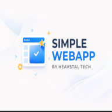

# Simple WebApp (PWA)




A production-ready, Open-Source boilerplate for building high-performance Web Applications with **Next.js**, **Tailwind CSS**, and built-in **Progressive Web App (PWA)** capabilities.

🔗 **Live Demo:** [https://simple-webapp-ht.vercel.app](https://simple-webapp.vercel.app)

## 🚀 Features

*   **PWA Ready:** Installable on mobile/desktop, offline support, and service workers (via `@ducanh2912/next-pwa`).
*   **SEO Optimized:** Pre-configured `next-sitemap`, `robots.txt`, and JSON-LD Structured Data.
*   **Modern Stack:** Next.js 16 (App Router), React 18/19, and TypeScript.
*   **Styling:** Tailwind CSS with Dark Mode support.
*   **API Management:** Example API routes included in `app/api`.
*   **Components:** Modular architecture with reusable components.

## 🛠️ Getting Started

Follow these steps to set up the project locally.

### Prerequisites

*   Node.js 18.17 or later
*   npm, yarn, or pnpm

### Installation

1.  **Clone the repository:**
    ```bash
    git clone https://github.com/HeavstalTech/Simple_WebApp.git
    cd Simple_WebApp
    ```

2.  **Install dependencies:**
    ```bash
    npm install
    ```

3.  **Run the development server:**
    ```bash
    npm run dev
    ```

4.  Open [http://localhost:3000](http://localhost:3000) in your browser.

## 📱 PWA Testing

To test the Progressive Web App features (installability and offline mode):

1.  Build the project locally:
    ```bash
    npm run build
    ```
2.  Start the production server:
    ```bash
    npm start
    ```
3.  Open `http://localhost:3000`. You should see an install icon in your browser address bar.

## 📂 Project Structure

```
├── app/                # Next.js App Router (Pages & Layouts)
│   ├── api/            # Backend API routes
│   ├── robots.ts       # SEO: Robots.txt generator
│   └── sitemap.ts      # SEO: Sitemap generator
├── components/         # Reusable UI components (Footer, Header, etc.)
├── public/             # Static assets (images, icons, manifest.json)
├── next.config.mjs     # PWA and Next.js configuration
└── tailwind.config.ts  # Styling configuration
```

## 🤝 Contributing

Contributions are welcome! Please read our [CONTRIBUTING.md](CONTRIBUTING.md) for details on our code of conduct and the process for submitting pull requests.

## 📄 License

This project is licensed under the MIT License - see the [LICENSE](LICENSE) file for details.

---

## NOTE:

This link on this repo is broken, the official link to the website is: https://simple-webapp.vercel.app

<p align="center">
  Built with ❤️ by <a href="https://heavstal-tech.vercel.app">Heavstal Tech</a>
</p>
<p> Built with ❤️ by  <a href="https://GitHub.com/HeavstalTech">Heavstal Tech GitHub</a>
</p>
